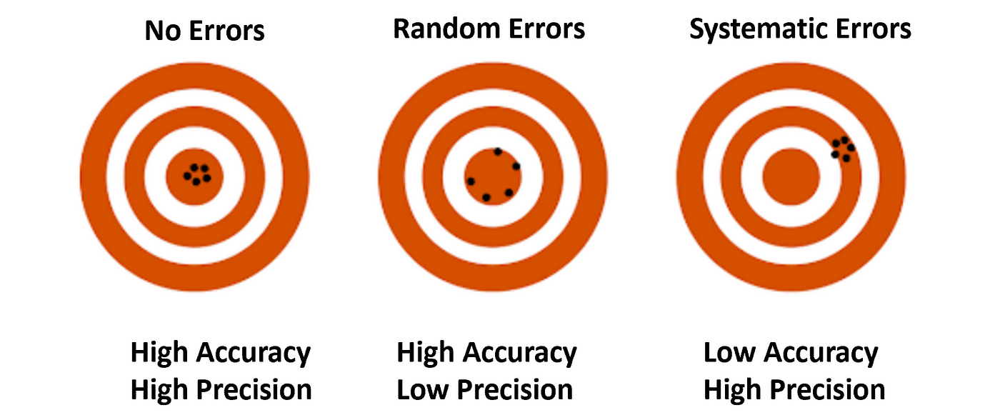

```{r setup, include=FALSE}
knitr::opts_chunk$set(echo = FALSE)
```

# Introduction to Small Area Estimation

## Introduction to SAE

-   We live in a world with increasingly complex problems (e.g. poverty, inequalities, climate change, etc.) and data is essential for solving them.

-   Many of these problems require identifying specific groups within a given population, in order to better understand the problem, or to develop better-targeted policies.

-   Often, the data on these sub-populations is scarce, and sometimes the domain for which the data is needed might not have been planned in the survey design.

---

## What is SAE?

- Small Area Estimation is a statistical modelling technique that uses **survey data** and **auxiliary information** (e.g. census data) to produce estimates of variables of interest at more granular level for the **domains** of interest.

- SAE methods produce "new" statistics that were not available before, at higher levels of **accuracy** than **direct estimates** generated through surveys.

- There are many SAE techniques -- the choice will depend on the availability of auxiliary data and the relationship between these data and the variable of interest.

---

## Key concepts

- **Survey data**: information collected from a sample of individuals through their responses to questions.
- **Sample**: smaller selection or subset of a larger group called population. The sample should be representative of the full population.
-   **Population**: full group we are interested in (e.g., all people in a country).
- **Small area** (or **domain**): small geographical area or spatial population unit for which reliable statistics cannot be produced due to limitations in the available data.
-   **Estimator**: rule or formula to approximate unknown population parameters (e.g. sample mean, poverty rates).
-   **Direct estimator**: uses only the sample from the domain itself.
- **Indirect estimator**: uses auxiliary information to approximate the population values.
-   **Accuracy**: distance between the statistical estimates and the "correct" values. It includes random errors (unpredictable and due to chance e.g. stopwatch), and systematic errors (consistent and repeatable e.g. biased scale)




------------------------------------------------------------------------

## The role of surveys

-   Sample surveys are cost-effective methods for obtaining information about wide-ranging topics at frequent intervals over time [@ghosh1994small].

-   Surveys provide reliable estimators for areas where the sample size is large (large domains). These estimators can rely solely on area information and still be trust-worthy. These types of estimators are called ***direct estimators**.*

-   However, when data is scarce, direct estimators are likely to yield too large standard errors, due to the small size of the sample in the area. This makes these estimators unreliable.

-   There are two approaches to solving this problem:

    -   Increasing sample sizes – expensive, not always possible (when using past surveys).

    -   Changing the sampling design so the unplanned domain becomes planned – expensive, not always possible.

    -   Applying statistical techniques to obtain reliable small area estimates.

------------------------------------------------------------------------

> Small area estimation (SAE) is a part of the statistical science that improves the efficiency of direct estimators by combining methodologies from survey sampling and finite population inference with statistical models. [@morales2021course].

##  

# Direct domain estimation

## Introduction

## Design-based approaches

### Horvitz-Thompson Estimator

- Simple direct estimator -- calculated as the **weighted sum** of the sampled values of the target values of a domain.

$$
\hat{\bar{Y}}_i^{\text{DIR}} = \frac{1}{N_i} \sum_{j \in S_i} w_j y_j
$$

\footnotesize{where $N_i$ is the population size of domain $i$, $S_i$ is the set of sampled observations in domain $i$, $w_j$ is the sampling weight for unit $j$, and $y_j$ is the observation for unit $j$, for all $j \in S_i$.}

- **Design-unbiased** -- its expected value across all possible samples that could be drawn under a given design equals to the true value of the population.
- **Unreliable under small samples** -- when samples are small, variances are too large to be reliable.

### Generalised Regresion Estimator (GREG)

- The Generalised Regression Estimator (GREG) is a a model-assisted estimator that uses **auxiliary information** to improve accuracy.
- It uses information on **known population totals** for a vector of auxiliary variables for the sampled units.

$$
\hat{Y}_{i_{\text{GR}}} = \hat{Y}_{\text{GR}}(y_i) = \sum_{j \in s_i} w_j^* y_j,
$$

where 

-   Modified GREG estimator
-   Design issues

# Indirect domain estimation

-   Introduction
-   Synthetic estimator
-   Composite estimator

# Small area model

-   Introduction
-   Basic area-level model
-   Basic unit-level model
-   

# Key Concepts

-   **Small area (domain):** sub-population of interest for which data is scarce. It does not relate to the geographical size of the area, just to the size of the survey sample.

-   **Direct estimator:** estimator based on area sample only.
